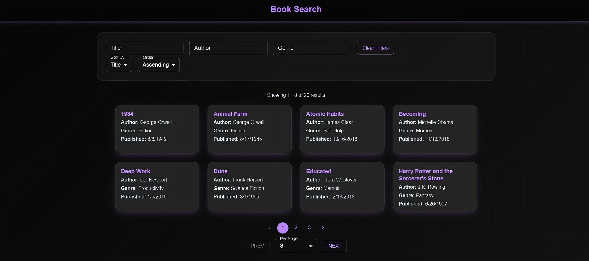
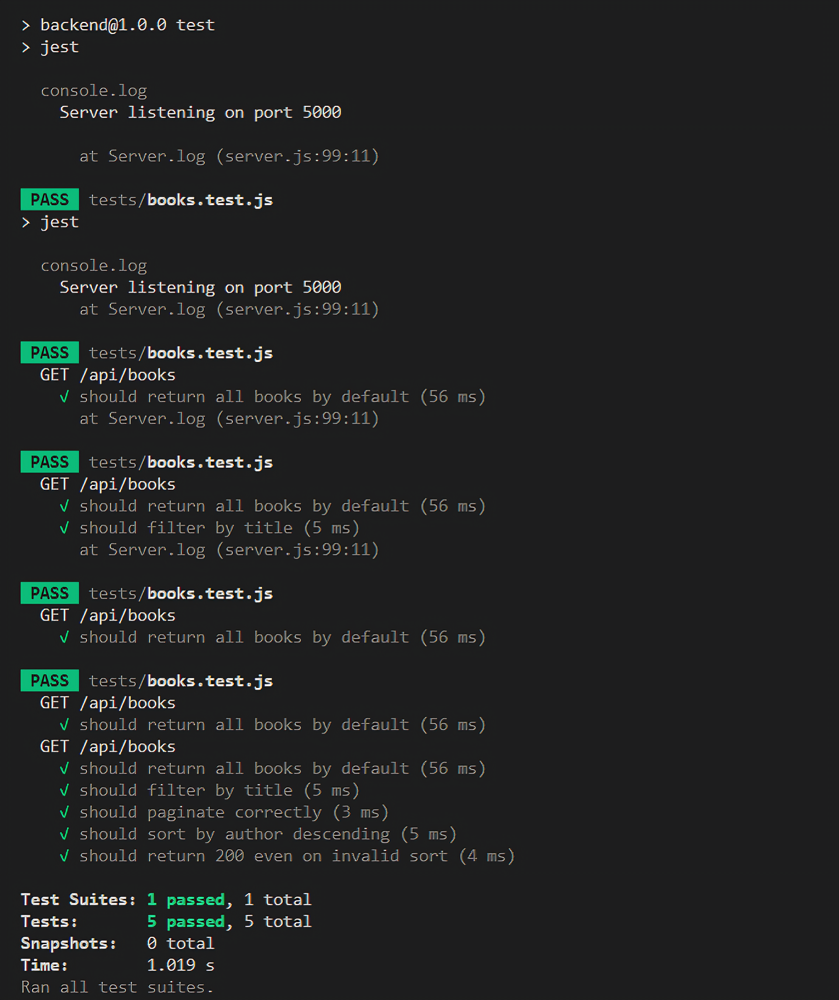

# 📚 Book Search App

This project was developed as part of **React Developer Task 12**, which involved implementing search functionality with filters for a Book API in a full-stack application.

Built using **React**, **Material-UI**, **Express.js**, and **Node.js**. Deployed on **Netlify** (Frontend) and **Render** (Backend).

---

## 🚀 Live Demo

- 🔗 **Frontend**: [https://booksearchdev.netlify.app](https://booksearchdev.netlify.app)
- 🌐 **API**: [https://book-search-5x6s.onrender.com/api/books](https://book-search-5x6s.onrender.com/api/books)

---
### 🔹 Preview
<p align="center">
  
</p>

---

## 📝 React Developer TASK 12 Implementation

### ✅ Day 1: Backend Setup and Search API Enhancement

- Enhanced the API to accept query parameters for:
  - `title`
  - `author`
  - `genre`
- `/api/books` endpoint implemented to return filtered search results.

---

### ✅ Day 2: Pagination and Sorting Support

- Supports `page` and `pageSize` parameters to paginate results.
- Sorting implemented using:
  - `sortBy` → `title`, `author`, `publicationDate`
  - `sortOrder` → `asc`, `desc`
- Validations and default fallback for invalid inputs are handled properly.

---

### ✅ Day 3: Frontend UI Implementation

- UI includes filters for **title**, **author**, and **genre**.
- Dynamically displays books using responsive card layout.
- Uses Material UI for styling and layout.

---

### ✅ Day 4: Frontend Pagination and Sorting UI

- UI controls for:
  - Pagination (Next, Prev, specific page)
  - Items per page (8, 12, 20, 50)
  - Sorting field and order
- Displays results count and current range.
- Shows loading spinner during API calls.

---

### ✅ Day 5: Error Handling and Validation

- Backend validates invalid query values and falls back gracefully.
- Frontend displays alerts for:
  - Empty search results
  - Backend/API failure
  - Invalid filters

---

### ✅ Day 6: Testing

- **Unit Tests** written using **Jest** and **Supertest**:
  - ✅ Fetch all books
  - ✅ Filter by title
  - ✅ Paginate correctly
  - ✅ Sort by author (descending)
  - ✅ Handle invalid `sortBy` with fallback
- All test cases passed successfully.

---

### ✅ Day 7: Documentation and Deployment

- Detailed `README.md` created.
- Frontend deployed on **Netlify** with `.env.production`.
- Backend deployed on **Render** using `server.js`.

---

## 🛠️ Tech Stack

| Frontend        | Backend        | Testing       |
|----------------|----------------|---------------|
| React (Vite)    | Express.js     | Jest          |
| Material-UI    | Node.js        | Supertest     |
| Axios          | CORS           |               |

---

## 📁 Folder Structure

```

Book-Search/
├── backend/            # Express server with API
│   ├── server.js       # API and filtering logic
│   ├── tests/          # Unit tests using Jest
├── book-frontend/      # React + MUI frontend
│   ├── App.js          # UI logic and layout
│   ├── .env.production # API base URL
├── assets/             # README screenshots
│   ├── preview\.png
│   └── test.png

````

---

## ⚙️ Local Setup

### 🔧 Clone & Install

```bash
git clone https://github.com/Prathamshettyy/Book-Search.git
cd Book-Search
````

### ▶️ Start Backend

```bash
cd backend
npm install
npm start
```

### ▶️ Start Frontend

```bash
cd book-frontend
npm install
npm run dev
```

> 🔑 Add `.env` in `book-frontend`:

```env
REACT_APP_API_URL=http://localhost:5000
```

---

## ✅ Run Backend Tests

```bash
cd backend
npm test
```

### 📌 What is Tested?

* Returns all books (default)
* Filters books by title
* Paginates correctly
* Sorts by author in descending order
* Handles invalid `sortBy` without crashing

> ✔️ All unit tests passed

### 🔹 Unit Test Output
<p align="center">
  
</p>

---

## 📄 Deployment Summary

### ✅ Frontend (Netlify)

* Deployed to: [booksearchdev.netlify.app](https://booksearchdev.netlify.app)
* `.env.production` sets API URL to Render backend
* `netlify.toml` configures build and redirects

### ✅ Backend (Render)

* Deployed to: [book-search-5x6s.onrender.com](https://book-search-5x6s.onrender.com)
* Uses in-memory book data from `server.js`

---

## 👨‍💻 Author

**Pratham Shetty**
GitHub: [@Prathamshettyy](https://github.com/Prathamshettyy)

---

## ✅ Project Status

**Completed** – All requirements from **React Developer Task 12** have been implemented, tested, and deployed.

